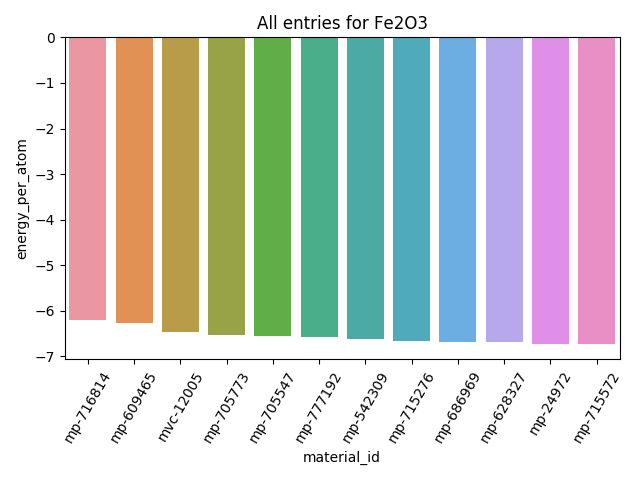

# Materials Project Querying Tool

A postdoc programming challenge: Query the materials project for a given material, count all returned entries and give the ground state material's id.

## Getting Started

### Run test:

Run the test as follows with `<API_KEY>` replaced by user [API key](https://www.materialsproject.org/open): 

```
python3 test_querier.py <API_KEY>
```

### Run the main code:

run the main code as follows with `<material>` replaced by the target material's chemical formula , e.g. "Fe2O3": 

```
python3 query-mp-database.py <API_KEY> <material>
```

for help

```
python3 query-mp-database.py -h 
```

options:

 -p : for plotting the results

### Example:

input:

```
python3 query-mp-database.py <API_KEY> Fe2O3 -p
```

output:

\pagebreak

```
+---------------+-------------------+
| material_id   |   energy_per_atom |
|---------------+-------------------|
| mp-716814     |          -6.18966 |
| mp-609465     |          -6.2578  |
| mvc-12005     |          -6.47026 |
| mp-705773     |          -6.52392 |
| mp-705547     |          -6.54611 |
| mp-777192     |          -6.57339 |
| mp-542309     |          -6.61652 |
| mp-715276     |          -6.66052 |
| mp-686969     |          -6.67518 |
| mp-628327     |          -6.67988 |
| mp-24972      |          -6.71653 |
| mp-715572     |          -6.71684 |
+---------------+-------------------+
12 entries found for query: Fe2O3
Most stable material: mp-715572 (-6.716840 eV/atom)
```
plot:



## Prerequisites

* python 3.6
* pymatgen
* numpy
* matplotlib
* seaborn
* pandas
* tabulate
* unittest
* requests


## Author

[**ErpanArkin**](https://github.com/erpanarkin)

## Date
**2017-Dec**
